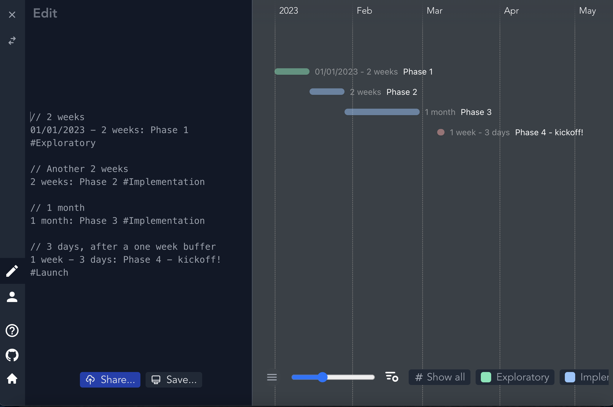
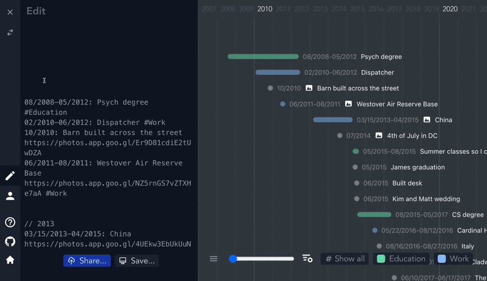
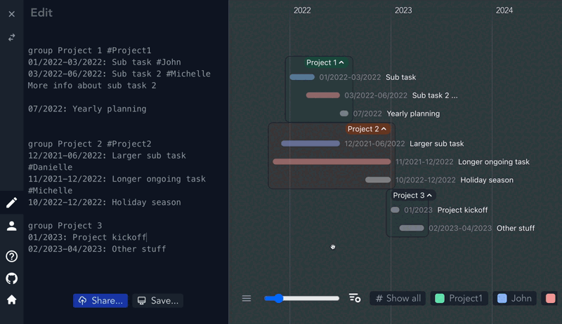

# [Cascade.page](https://cascade.page)
Inspired by @cheeaun's [life](https://github.com/cheeaun/life).

Cascade.page is a text-to-timeline tool. You write markdown-ish text and it gets converted into a nice looking cascading timeline. 

Use it [here](https://cascade.page).

<br>
<br>

### Table of contents
- [Cascade.page](#cascadepage)
    - [Table of contents](#table-of-contents)
  - [Cascade](#cascade)
    - [Header](#header)
      - [Tags and colors](#tags-and-colors)
      - [Date formatting](#date-formatting)
    - [Events](#events)
      - [Date Ranges](#date-ranges)
        - [Dates](#dates)
        - [Relative Dates](#relative-dates)
      - [Event Description](#event-description)
        - [Tags](#tags)
        - [Links](#links)
        - [Locations](#locations)
        - [Photos](#photos)
        - [References](#references)
    - [Groups](#groups)
    - [Sorting](#sorting)
  - [Header Quick Reference](#header-quick-reference)
  - [Event Quick Reference](#event-quick-reference)
  - [Saving and sharing](#saving-and-sharing)
  - [Public by default](#public-by-default)

<br>
<br>

## Cascade

A Cascade is composed of an optional [header](#header) and one or more [events](#events).
<br>
<br>

### Header

The header of a cascade indicates things about the cascade like visual preferences and metadata. It is the first part of a cascade; that is, **anything before the first event is considered the header**. 

Right now there are only two things you can include in the header: [tag colors](#tags-and-colors) and [date formatting](#date-formatting). Anything else in the header area (that is, everything else before the first event that is not date formatting or tag colors) will be ignored.
<br>
<br>

#### Tags and colors

You can indicate the color you want certain tagged events to appear like so:

```
#Travel: blue
#Education: green
#Economics: #abc // hex color
```

CSS color literals are supported (e.g., `aliceblue` or `mediumvioletred`) as well as hex colors (e.g., `#a13bbb`).

So, if you have an event like the following
```
2012-2013: Germany and Italy #Travel
```
it will be colored as blue in the cascade.
<br>
<br>

#### Date formatting
Non-ISO8601 dates default to American formatting  (Month/Day/Year). This can be changed to European formatting by adding the following line in the header area (before any event): 
```
dateFormat: d/M/y
```
This is a hardcoded line, any other format attempt will not work.

<br>
<br>

### Events
An event is a [Date Range](#date-ranges) followed by a colon followed by an [event description](#event-description):

```
12/2012: End of the world

1961: Year after 1960
Later, 1962 would happen

1 year: 1962, just as predicted

2020-02-22T12:13:14Z-now: How long the pandemic has been going on?
12/7/1941: Pearl Harbor attacked
Launched US into WWII

2022-02-22T16:27:08.369Z: More specific thing
2021-01-02T06:27:00Z-2022: ongoing project work until the end of 2022


```

<br>
<br>

#### Date Ranges
A date range is a period from one date to another. Every event has an associated date range, whether it has an explicitly written end date or not. A date range is typically `Date[-Date]`; that is, one date optionally followed by a dash and another date.

If an end date is not specified, the range is as long as its granularity.

For example, the event
```
2001: A Space Odyssey
```
starts January 1, 2001, and lasts through December 31, 2001.


| Example                                     | Inferred Range                                   | Explanation                                                                       |
| ------------------------------------------- | ------------------------------------------------ | --------------------------------------------------------------------------------- |
| `2024`                                      | `2024-01-01T00:00:00Z` to `2025-01-01T00:00:00Z` | From the start of 2024 to the end of 2024                                         |
| `04/1776`                                   | `1776-04-01T00:00:00Z` to `1776-05-01T00:00:00Z` | From the start of July 1776 to the end of July 1776                               |
| `01/01/2024`                                | `2024-01-01T00:00:00Z` to `2024-01-02T00:00:00Z` | From the start of January 1, 2024, to the end of January 1, 2024 (the whole day). |
| `11/11/2024-12/12/2024`                     | `2024-11-11T00:00:00Z` to `2024-12-13T00:00:00Z` | From the start of November 11, 2024, to the end of December 12, 2024.             |
| `2031-11-19T01:35:10Z-2099-08-04T18:22:48Z` | `2031-11-19T01:35:10Z` to `2099-08-04T18:22:48Z` | Exactly as specific as the ISO dates say.                                         |


<br><br>

##### Dates
A date can be expressed in a few forms. Human readable dates are supported, like `1665`, `03/2222`, or `09/11/2001`, as well as IO8601 dates, like `2031-11-19T01:35:10Z`. Human readable date formatting defaults to the American Month/Day/Year but can be changed to European formatting via the [header](#date-formatting).

<br><br>

##### Relative Dates
If you have events that are based off of, or relative to, other events, you can describe their relationship to get the range you want.

For example, say you are working on a project tracker. You could outline the phases of your project by using absolute dates, like the following:
```
// To indicate we are using European date formatting
dateFormat: d/M/y

// 2 weeks
01/01/2023 - 14/01/2023: Phase 1 #Exploratory

// Another 2 weeks
15/01/2023 - 31/01/2023: Phase 2 #Implementation

// 1 month
02/2023: Phase 3 #Implementation 

// 3 days, after a one week buffer
07/03/2023 - 10/03/2023: Phase 4 - kickoff! #Launch
```


However, as soon as something changes (say something slips or an estimate was wrong), you would have to go through all events and change their dates manually. This would be especially troublesome if the change is early on.

With relative dates, we can express the same timeline like so:
```
// 2 weeks
01/01/2023 - 2 weeks: Phase 1 #Exploratory

// Another 2 weeks
2 weeks: Phase 2 #Implementation

// 1 month
1 month: Phase 3 #Implementation 

// One week after phase 3 ends, a 3 days kickoff event
1 week - 3 days: Phase 4 - kickoff! #Launch
```


Relative dates base themselves off the previous date, and this goes all the way back to our first date, `01/01/2023`.

This works well enough for serial dates that are each dependent on the last, but what if we have multiple events that are all dependent on the same event? We can do that using event ids:
```
// Event ids are represented by an exclamation point followed
// by the id - like !Phase1
01/01/2023 - 2 weeks: Phase 1 #Exploratory !Phase1

// Another 2 weeks
after !Phase1 2 weeks: Phase 2, in parallel with Phase 3 #Implementation

// 1 month
after !Phase1 1 month: Phase 3, in parallel with Phase 2 #Implementation 

// 3 days, after a one week buffer
1 week - 3 days: Phase 4 - kickoff! #Launch
```

The word `after` is optional, we could say `!Phase1 2 weeks: Phase 2, in parallel with Phase 3 #Implementation` to have the same effect. 

Relative dates will first attempt to refer to the event that was specified by a provided event id. For `!Phase1 2 weeks: Phase 2`, the event with the id `Phase1` is looked for, is checked for when it ends, and is used as the reference upon which `2 weeks` is based.

If we can't find the event id, or no event id is given, the relative date is instead based upon the last date in the cascade - "last" here meaning most recently written, as the cascade is parsed from top to bottom. So if we have a cascade like this:
```
2020: Pandemic
2021 - 2023: More pandemic
1 year: Less pandemic?
```

`1 year` is based off the last date seen, which would be `2023`, or, more specifically, the end of `2023`.

This also means that we can base our end date off of our start date:
```
12/25/2022: Christmas
5 days - 3 days: New Years' stuff
```

Here, `5 days` is five days after the previously seen date (`12/25/2022`), which would make it `12/30/2022`, while `3 days` is three days after the previous date, which is our start date of `12/30/2022`.

Two relative dates together, like `x days - y weeks: ...`, can therefore essentially be read as `x days after the previous event and lasts for y weeks`.

The only exception to this is the shorthand singular relative date, like `x years:...`, which means `immediately after the last event and lasts for x years`.

<br><br>

#### Event Description
An event description is everything after the date range of the event, **up to the next event**. Event descriptions can span multiple lines. For `12/2012: End of the world`, the event description is just `End of the world`. For the following event:
```
1961: Year after 1960
Later, 1962 would happen
```
the event description is 
```
Year after 1960
Later, 1962 would happen
```

Everything not on the first line (where the date range is specified) up to the next event will be put in an overflow box that can be expanded by clicking on the event. Such an overflow is indicated in the timeline with an ellipsis (...). Event descriptions can include [tags](#tags), [links](#links), [locations](locations), [photos](#photos), and [references](#references). 

<br><br>

##### Tags
Events can be tagged to visually indicate they belong to some category. Simply add your tag text in any part of an event's description to tag it:
```
2022: Happy 95th Birthday Queen Elizabeth #UK #Royalty 
```
A list of all tags appears at the bottom of the screen to allow for filtering by tags.

<br>
<br>

##### Links
Links are similar to markdown links: link dislpay text in brackets followed by the url in parentheses:

```
2018 - 3 years: [Google](www.google.com)
```
<br><br>

##### Locations
Events can have zero or more locations associated with them, indicated with the following syntax: `[name of location](map|location)`

```
09/2018: Road trip to Seattle
[Devil's Tower](location)
[Glacier National Park](map)
[Seattle](map)
```

<br><br>

##### Photos
An event may include a shareable, public google photos link that will be displayed once the event is clicked on. Only one photos link per event is supported.
<br><br>

##### References
Link to other cascades with the `@` syntax:
```
1919: Treaty of Versailles @wwi
```

### Groups

Events can be grouped. To indicate a group, write `group` at the beginning of a line. All events up to the start of the next group, the end of the cascade, or the keyword `endGroup` (whichever of these three comes first) are in the group.

For example,
```
group The 90s // The title for this group is "The 90s"

1991: Desert Storm
1994: Friends premiered
05/14/1998: Series finale of Seinfeld

// Since we're defining a new group here, 
// the preceding group ends and is comprised of the 
// previous three events.
group The 2000s 

03/2005: Premiere of The Office (US)

// Explicitly end the group
endGroup

// This event is not part of a group
2020: Pandemic

...

```

If you want an event group to start out collapsed, indent the `group` line definition.

```
2001: John is born

// The space here before `group`
// means the group will appear collapsed at first
  group Less important events #StillCoolThough

2003: Someone else is born
...

endGroup
```

<br><br>

### Sorting



## Header Quick Reference
| Item                                                  | Syntax                 | Example               |
| ----------------------------------------------------- | ---------------------- | --------------------- |
| Coloring tags                                         | `#[tag name]: <color>` | `#Movies: aquamarine` |
| Date format. Change the formatting to European style. | `dateFormat: d/M/y`    | `dateFormat: d/M/y`   |
<br><br>

## Event Quick Reference
| Item                                                                                                | Syntax                                                       | Example                                                                                                                     |
| --------------------------------------------------------------------------------------------------- | ------------------------------------------------------------ | --------------------------------------------------------------------------------------------------------------------------- |
| Event                                                                                               | `[DateRange]:[EventDescription]`                             | `08/2015-05/2017: CS degree #Education`                                                                                     |
| DateRange                                                                                           | `[Date][-Date]`                                              | `1998-06/01/2000`                                                                                                           |
| Date. `now` is a special keyword which means what you think it does                                 | `[HumanDate\|ISO8601\|now]`                                  | `01/30/1888`                                                                                                                |
| HumanDate. Defaults to American formatting (Month/Day/Year, can be overridden in [header](#header)) | `[m/d-]yyyy`                                                 | `2002` or `01/2002` or `12/25/1901`                                                                                         |
| ISO8601 format. The `T` and `Z` are required.                                                       | `YYYY-MM-DD`T`HH:MM:SS:MS`Z                                  | `1859-05-09T12:01:01Z`                                                                                                      |
| Event description                                                                                   | `([text]\|[Tag]\|[Location]\|[Link]\|[Photos])*`             | `07/2014: 4th of July in DC https://photos.app.goo.gl/d418j6GSkCD5LGmY8 #Travel @sue @greg [Washington, DC](location)`      |
| Tag                                                                                                 | `#[tag name]`                                                | `1999: The Matrix #Movies`                                                                                                  |
| Location                                                                                            | `[location name](location\|map)`                             | `02/23/1836: Battle of the Alamo (The Alamo, TX)[map]`                                                                      |
| Link                                                                                                | `[display text](link)`                                       | `05/25/2021: [cascade.page](https://cascade.page) featured on [Hacker News](https://news.ycombinator.com/item?id=27282842)` |
| Photos. Has to be a public link! Currently only one photo link per event is supported.              | `<something that looks like a google photos shareable link>` | `07/2017: 4th of July in DC https://photos.app.goo.gl/d418j6GSkCD5LGmY8`                                                    |
| Reference. Reference and link to other cascades.                                                    | `@[other cascade name]`                                      | `09/2019: Dinner with @karl` or `2020-2022: COVID-19 Pandemic @jenny/covid @covidcascade`                                   |
| Comment                                                                                             | `//[text]`                                                   | `// this is a comment`                                                                                                      |
|                                                                                                     |

<br>
<br>

## Saving and sharing

To save a cascade to your computer, click the `Save...` button while on the Editor tab of the sidebar. It will be saved locally, and you can come back and edit or view it later, as long as it's on the same device. 

You can view cascades that you've saved from the profile tab of the sidebar.

To share a cascade with a link, you will need to make an account. You can make an account by sending yourself a signin link from the profile page. Once signed in, you will need to choose a username from which your cascades will be hosted. For example, if you choose the name `jeff`, all your cascades will be accessible from `https://cascade.page/jeff/...`. If you share a cascade with the same name as your username, it will be accessible from `https://cascade.page/[your username]/`, otherwise, it will be accessible from `https://cascade.page/[your username]/[cascade name]`.

All in all, the steps are:
1. Send yourself a signin link from the profile tab.
2. Click the link to login.
3. Choose a username - all your shared cascades will be available from `https://cascade.page/[your username]/...`
4. Share your cascade

## Public by default

Any cascade you share is public by default - anyone could view it. Any cascade you save locally only on your computer is, of course, only accessible on that device.